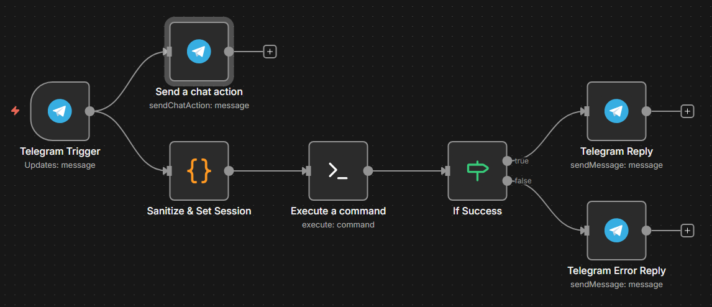

# n8n Gemini CLI Agent (Telegram Edition)

> **Credit:** This project is inspired by and adapted from [NetworkChuck's n8n-claude-code-guide](https://github.com/theNetworkChuck/n8n-claude-code-guide).

While the original guide focuses on **Claude Code** and **Slack**, this project adapts the concept for **Google Gemini** and **Telegram**, making it a perfect fit for users in the Google ecosystem or those who prefer Telegram for their home automation notifications.

## 🤖 What is this?



This project creates a bridge between **n8n** and the **Google Gemini CLI**. It allows you to chat with a powerful, context-aware AI agent directly from Telegram, with the AI running locally on your server (via SSH).

**Key Differences from the Original:**
*   **AI Engine:** Replaces `claude` with `gemini` CLI.
*   **Interface:** Replaces **Slack** with **Telegram**.
*   **Cost:** Leveraging Gemini's API (often free/lower cost for personal use tiers) vs. Anthropic's pricing.

## 🚀 Features

- **📱 Telegram Interface:** Chat with your AI agent on the go.
- **🏠 Remote Homelab Management:** Manage your server from anywhere. Ask questions like:
    *   _"Any dockers down?"_
    *   _"What is the memory consumption now?"_
- **🔒 Secure Execution:** Runs commands on your local machine via a secure SSH connection from n8n.
- **⚡ Fast Responses:** Optimized for the Gemini CLI.

## ⚙️ Architecture

1.  **Trigger:** You send a message to your Telegram Bot.
2.  **n8n Processing:**
    *   Sanitizes your text.
    *   Prepares the environment.
3.  **SSH Tunnel:** n8n logs into your host machine via SSH.
4.  **Gemini Execution:** It runs the command: `gemini "Your prompt" --resume latest --approval-mode yolo`.
5.  **Reply:** The output (or error) is sent back to your Telegram chat.

## 🛠️ Prerequisites

1.  **n8n:** Installed and running (Docker or Local).
2.  **Google Gemini CLI:** Installed on your host machine.
    *   *Tip:* Ensure you can run `gemini "hello"` in your terminal first.
3.  **Telegram Bot:**
    *   Chat with `@BotFather` on Telegram to create a new bot and get your **API Token**.
4.  **SSH Access:** n8n needs SSH access to the machine running the Gemini CLI.

## 📥 Setup Guide

### 1. Clone & Prepare
```bash
git clone https://github.com/yourusername/n8n-gemini-cli.git
cd n8n-gemini-cli
```

### 2. Configure Credentials in n8n
Before importing the workflow, set up these credentials in n8n:
*   **Telegram API:** Use the token from `@BotFather`.
*   **SSH Password/Key:** Provide the login details for the machine running Gemini.

### 3. Import the Workflow
1.  Open your n8n dashboard.
2.  Go to **Workflows** > **Import from File**.
3.  Select `workflows/GeminiCLI.json` from this repository.
4.  **Update the Nodes:**
    *   Open the **Telegram Trigger** and **Telegram Reply** nodes and select your new Telegram credentials.
    *   Open the **Execute Command** (SSH) node and select your SSH credentials.
    *   *Important:* Check the **CWD** (Current Working Directory) in the SSH node. It defaults to `/path/to/workdir`. Change this to your actual home directory (e.g., `/home/youruser`).

### 4. Test It!
Start the workflow and send "Hello" to your Telegram bot. If everything is wired up, Gemini will reply!

## 📂 Project Structure

```
n8n-gemini-cli/
├── workflows/    # The "Brains" - Import this JSON into n8n
├── src/          # Helper scripts (if needed)
├── docs/         # Additional notes
└── .env.example  # Env var template
```

## ⚠️ Important Notes & Limitations

### 1. YOLO Mode Enabled (`--approval-mode yolo`)
This workflow executes the Gemini CLI in **YOLO mode**.
*   **What it is:** A mode that automatically accepts all tool actions (e.g., editing files, running shell commands) without asking for user confirmation.
*   **Why it's needed:** n8n runs in the background (non-interactive), so there is no user present to press "y" to approve an action. Without this, the workflow would hang indefinitely.
*   **Note:** This grants the AI agent broad permissions on your host machine. Ensure you trust the prompts you send!

### 2. Session Persistence & Concurrency
**Current Configuration:** The workflow uses the `--resume latest` flag to maintain conversation context.

*   **How it works:** This instructs the Gemini CLI to resume the most recently active session. This allows for conversation history (e.g., asking follow-up questions) for a **single user**.
*   **The Limitation (Concurrency):** Since it always blindly picks the "latest" session, if multiple users (or different devices) interact with the bot simultaneously, their sessions will get mixed up.
*   **Recommendation:** This setup is **best suited for solo use**. If you are the only one using the bot, context retention should work fine.
*   **Note:** True unique session management (per user/chat ID) is not yet supported by the Gemini CLI (see [Issue #1530](https://github.com/google-gemini/gemini-cli/issues/1530)).

## 📄 License

This project is licensed under the MIT License.